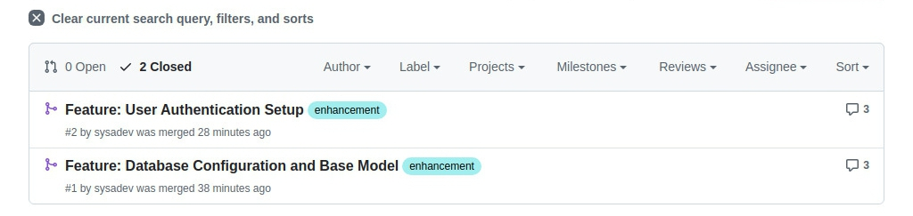

# Version Control: Git & GitHub Workflow

## Purpose
This repository was created to demonstrate basic version control skills using Git and GitHub. It serves as a practical exercise in setting up a new public repository, tracking changes, and understanding the foundational workflow required for backend development projects.

## Branch Names and Purpose
I used a feature-branch workflow to keep development isolated and clean.

- **`master`**: The stable, production-ready branch.
- **`feature/database-config`**: Established the SQLAlchemy connection and created the `BaseModel` class.
- **`feature/user-auth-routes`**: Implemented user data schemas and skeleton API endpoints for login/registration.
- **`feature/bug-fix`**: (Originally `feature/test-revert`) Used to demonstrate branch renaming and the `git revert` process.

## Merged Pull Requests
Both feature branches were merged into `master` after a simulated peer review process. 

## Most Frequent Git Commands
Throughout this project, these were the tools I used most:

- `git checkout -b <name>`: To create new feature branches.
- `git status`: To check for uncommitted changes (crucial for catching floating edits!).
- `git add .` & `git commit -m "..."`: To stage and save progress.
- `git push -u origin <name>`: To sync local work with GitHub.
- `git revert HEAD`: To safely undo mistakes without erasing history.
- `git fetch`: To update local information about remote branch changes.

## Lessons Learned
- **The Importance of Committing:** I learned that switching branches without committing can cause changes to "leak" into other branches, creating confusion.
- **Resolving Conflicts:** Handling the `app/models.py` conflict taught me how Git identifies overlapping edits and how to manually choose the best code from two different sources.
- **Reviewing Matters:** Simulating the PR review helped me see that code is better when double-checked for best practices (like adding timestamps or environment variable handling).
